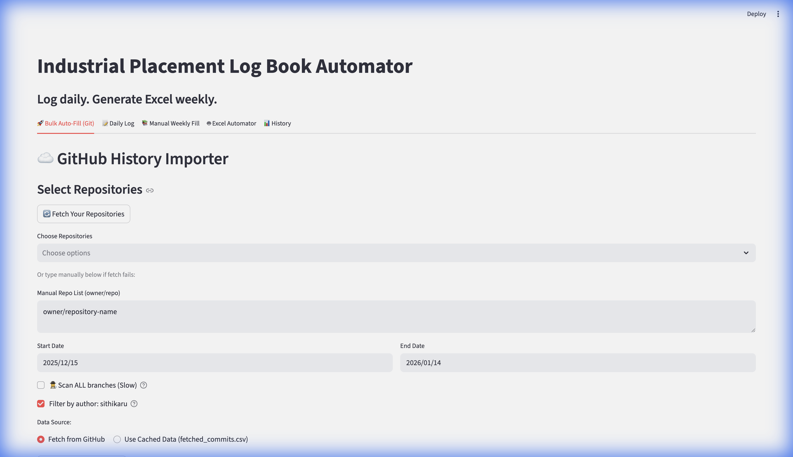
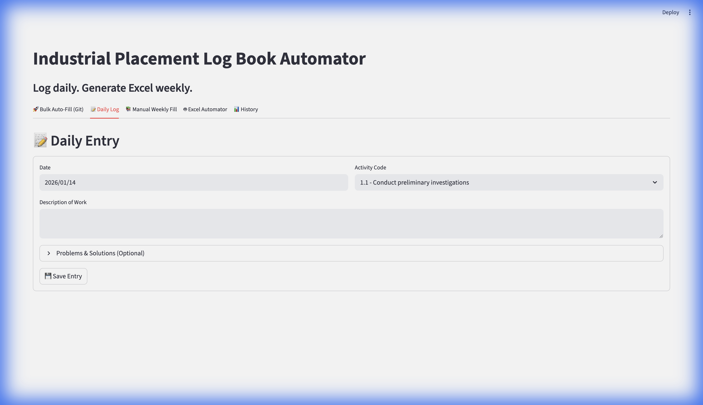
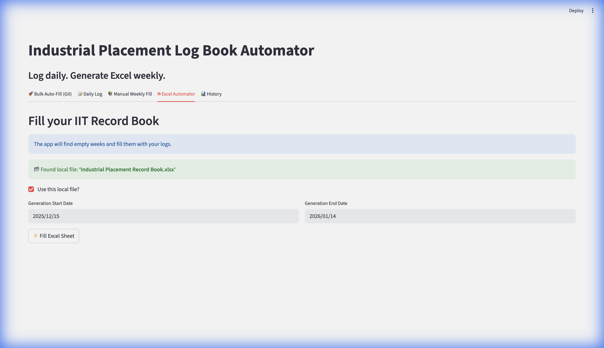
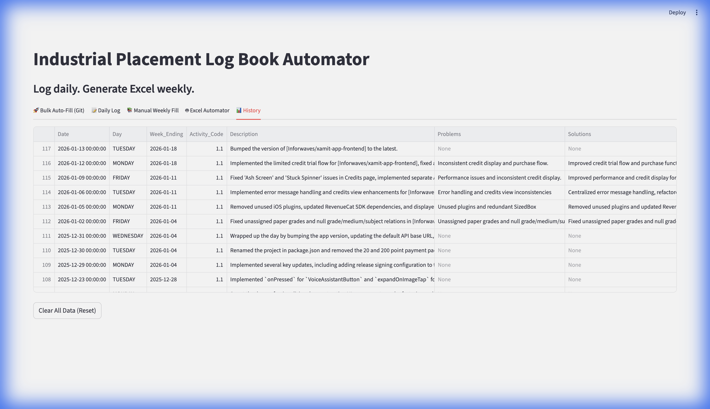

# 🚀 Industrial Placement Log Book Automator

A powerful Streamlit application designed to automate the creation of daily placement logs using GitHub commit history and AI summarization.

## ✨ Key Features

-   **🤖 AI-Powered Auto-Fill**: Automatically fetches your GitHub commits and generates professional, human-like daily summaries using Groq AI (Llama 3).
-   **📁 GitHub Integration**: Fetches commits directly from your repositories, allowing filtering by date, branch, and author.
-   **⚡ Smart Caching**: Save fetched commits locally to avoid repeated API calls and speed up processing.
-   **📊 Excel Report Generation**: Generates a formatted Excel record book compatible with university templates, including weekly grouping and problem/solution sections.
-   **📝 Manual Entry**: fallback options for manual daily or weekly bulk entries.
-   **💾 Persistence**: Saves all logs locally to `my_placement_logs.csv` so you never lose data.

---

## 🛠️ Setup & Installation

### 1. Prerequisites
-   Python 3.8 or higher.
-   A GitHub Account (and a Personal Access Token).
-   A [Groq API Key](https://console.groq.com/) (for AI features).

### 2. Installation
Clone the repository and install the dependencies:

```bash
pip install -r requirements.txt
```

### 3. Environment Configuration (`.env`)
Create a file named `.env` in the root directory and add your keys. This is crucial for the app to function.

```ini
# Required for fetching private/public repos
GITHUB_USERNAME=your_github_username
GITHUB_TOKEN=your_github_personal_access_token

# Required for AI Summarization
GROQ_API_KEY=gsk_your_groq_api_key_here
```

#### 🔑 How to get these keys:

**1. GitHub Personal Access Token (Classic)**
   - Go to **GitHub Settings** > **Developer settings** > **Personal access tokens** > [**Tokens (classic)**](https://github.com/settings/tokens).
   - Click **Generate new token (classic)**.
   - Give it a Note (e.g., "LogBook").
   - **Scopes**: Check the **`repo`** box (Full control of private repositories). This is required to read your commits.
   - Click **Generate token** and copy the string starting with `ghp_`.

**2. Groq API Key**
   - Go to the [Groq Console](https://console.groq.com/keys).
   - Sign in with your email or GitHub.
   - Click **Create API Key**.
   - Copy the key starting with `gsk_`.

> **Note**: If you don't provide a `GROQ_API_KEY`, the app will simply list your commit messages without summarizing them.

---

## 🚀 How to Run

Run the application using Streamlit:

```bash
streamlit run app.py
```

The app will open automatically in your default web browser (usually at `http://localhost:8501`).

---

## 📖 User Guide

### 1. 🤖 Bulk Auto-Fill (Git) - *Recommended*


This is the central hub of the application. It automates the log-writing process by analyzing your GitHub history.

#### 🎛️ Interface Controls
| Control | Description |
| :--- | :--- |
| **Start / End Date** | Defines the range of time you want to generate logs for. Only commits within these dates are fetched. |
| **Fetch Your Repositories** | Connects to GitHub using your Token to list all available repositories (private & public). |
| **Choose Repositories** | A dropdown to select which projects you worked on. You can select multiple. |
| **Scan ALL branches** | **Unchecked (Default)**: Scans only the default branch (usually `main` or `master`).<br>**Checked**: Scans every single branch. Use this if you work on feature branches that haven't been merged yet. *Note: Considerably slower.* |
| **Filter by author** | **Checked**: Ignores commits made by other people. Uses `GITHUB_USERNAME` from your `.env`.<br>**Unchecked**: Includes commits from everyone. useful for pair programming. |
| **Data Source** | **Fetch from GitHub**: Pulls fresh data from the API. Updates `fetched_commits.csv`.<br>**Use Cached Data**: Loads data from the local CSV file. Perfect for re-running the AI prompt without waiting for GitHub. |
| **Fetch & Generate Logs** | The "Magic Button". It fetches the commits (or loads cache), batches them by day, sends them to Groq AI for summarization, and renders the specific "Project Name" into the logs. |

#### 🔄 Workflow: Generating Logs from Scratch
1.  Set your **Start Date** and **End Date**.
2.  Click **Fetch Your Repositories**.
3.  Select the relevant repos from the dropdown.
4.  Ensure **Fetch from GitHub** is selected.
5.  Click **Fetch & Generate Logs**.
6.  Wait for the AI to process (you'll see a progress bar).
7.  Review the generated table. You can edit the "Description" or "Problems" cells directly in the UI if needed.
8.  Click **Save to Record Book** to commit them to your history.

---

### 2. 📝 Daily Log


Use this tab for days where you didn't write code (e.g., meetings, research, design) or if you prefer manual control.

#### 🎛️ Interface Controls
| Control | Description |
| :--- | :--- |
| **Date** | The specific day for this log entry. |
| **Activity Code** | Dropdown matching standard placement activity codes (e.g., 1.1 Briefing, 4.2 Coding). |
| **Description** | The main content of your log. Be professional and concise. |
| **Problems / Solutions** | Optional fields to record specific technical challenges and how you solved them. |
| **Add Entry** | Saves this single entry to your local database (`my_placement_logs.csv`). |

---

### 3. 🗓️ Manual Weekly Fill


Designed for rapid backfilling of older logs where you might not have git data.

#### 🎛️ Interface Controls
| Control | Description |
| :--- | :--- |
| **Select Month/Year** | Sets the context for the table below. |
| **Weekly Grid** | A spreadsheet-like view where you can type directly into cells for each day of the week (Mon-Sun). |
| **Save Week** | Writes all 7 days' worth of data to your history file at once. |

---

### 4. ⚙️ Excel Automator


The final step. This takes your saved logs and formats them into the official Excel file for submission.

#### 🎛️ Interface Controls
| Control | Description |
| :--- | :--- |
| **Upload Template** | Drag and drop your empty university log book template (`.xlsx`). The app looks for a "WEEK ENDING" marker to know where to start filling. |
| **Start / End Date** | Defines which months to generate sheets for. The app creates a new tab for each month. |
| **Generate Excel** | Reads your `my_placement_logs.csv`, merges it with the Template, and performs the filling logic. |
| **Download Button** | Appears after generation. Click to save the final `Updated_Record_Book.xlsx`. |

---

### 5. 📜 History


Your database view.

#### 🔄 Features
-   **Sortable Columns**: Click "Date" to sort logs chronologically.
-   **Clear All Data (Reset)**: ⚠️ **Danger Zone**. This deletes `my_placement_logs.csv` and wipes your database. Use this only if you want to start completely fresh.

---

## 💡 Troubleshooting

-   **"Rate Limit Exceeded"**: If GitHub blocks you, wait a few minutes or ensure your `GITHUB_TOKEN` is valid.
-   **"Groq Error"**: Check your `GROQ_API_KEY`. If the AI is hallucinating, try reducing the batch size in the code or fetching fewer days at a time.
-   **"KeyError: Date"**: This means your history file is empty. Add a log entry to fix it.
